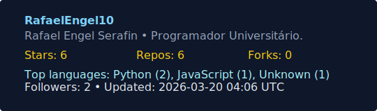

# GitHub Stats Generator

This project automatically generates a **custom SVG with your GitHub statistics**, updating **every hour** using GitHub Actions. No external services, no outdated cached data — everything is pulled directly from the GitHub API.

The result is a file called **`stats.svg`**, perfect for embedding in your GitHub profile README.

---

## Features 

* ⏱ **Updates every hour** (using GitHub Actions cron jobs)
* 🖼 **Generates a clean, minimal SVG** containing:

  * Total stars 
  * Public repositories 
  * Forks 
  * Followers 
  * Top 3 languages 
  * Timestamp for last update 
* Automatically uses your repository’s `GITHUB_TOKEN` (higher rate limits)
* Fetches all repos using pagination
* Fully customizable — colors, fonts, layout, data, everything!

---

## How it Works

1. A GitHub Actions workflow runs every hour.
2. It executes a Python script located at `scripts/generate_svg.py`.
3. The script fetches your GitHub profile + repo data via API.
4. It builds a new **`stats.svg`** file.
5. The workflow commits the updated SVG back to the repository.

You now have a **self-hosted, always-fresh stats badge**.

---

## Setup Instructions

### 1. Fork or clone this repository

```
git clone https://github.com/RafaelEngel10/github-stats-generator.git
```

### 2. Make sure the folder structure is correct

```
.github/workflows/generate-stats.yml
scripts/generate_svg.py
stats.svg (auto-generated)
```

### 3. Push to GitHub

The workflow triggers automatically after being pushed.

### 4. (Optional) Add to your GitHub Profile README

```md

```

Or for raw file via GitHub CDN:

```md

```

---

## Private Stats (Optional)

If you want to count **private contributions or private repository stats**, you’ll need a **GitHub Personal Access Token** with the `repo` scope.

Then:

* Go to **Settings → Secrets → Actions**
* Add a new secret: `PERSONAL_GH_TOKEN`
* Modify the workflow to use it:

```yaml
GITHUB_TOKEN: ${{ secrets.PERSONAL_GH_TOKEN }}
```

---

## 🛠 Technologies

* **GitHub API** — user & repository data
* **Python 3** — used to generate the SVG
* **GitHub Actions** — automation & scheduling
* **SVG** — clean, lightweight display format

---

## 📄 Files

### ✔ `.github/workflows/generate-stats.yml`

Runs every hour and commits stats.

### ✔ `scripts/generate_svg.py`

Fetches data from GitHub and renders the SVG.

### ✔ `stats.svg`

The output — auto-generated, do not edit manually.

---

## 🎨 Customization

You can modify:

* Font sizes
* Colors
* Layout
* Metrics included
* SVG background

Inside `generate_svg.py`, look for the `render_svg()` function.

---

## Manually Run the Workflow

You can trigger the workflow manually under:

**Actions → Generate GitHub Stats SVG → Run workflow**

---

## Contributing

Pull requests are welcome! Feel free to:

* Add themes
* Improve SVG design
* Add more stats
* Convert to TypeScript/Node.js
* Add caching or GraphQL support

---

## License

This project is open-source under the **MIT License**.

You are free to fork, modify, and use it anywhere.

